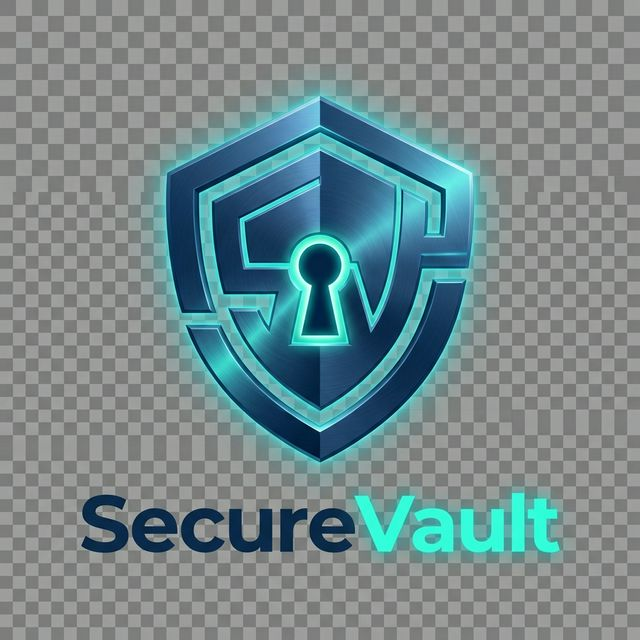

<div align="center">



# 🔐 SecureVault

**Plateforme de gestion de mots de passe auto-hébergée, sécurisée et open-source**

*By [Nextendo X Micka Delcato](https://github.com/Micka420-collab/SecureVault.git)*

[](https://github.com/Micka420-collab/SecureVault.git/releases)
[](LICENSE)
[](https://docker.com)
[](https://reactjs.org)
[](https://nodejs.org)

• [🐛 Issues](https://github.com/Micka420-collab/SecureVault.git/issues)

</div>

---

## ✨ Fonctionnalités

<table>
<tr>
<td width="50%">

### 🔑 **Coffre-Fort Sécurisé**
- Chiffrement **AES-256-GCM** de bout en bout
- **Zero-knowledge** : nous ne voyons jamais vos données
- Générateur de mots de passe robuste
- Organisation par catégories et favoris

</td>
<td width="50%">

### 📧 **Alias E-mail**
- Création d'adresses jetables
- Protection contre le spam
- Transfert automatique sécurisé
- Gestion intuitive

</td>
</tr>
<tr>
<td width="50%">

### 📁 **Documents Chiffrés**
- Stockage sécurisé (PDF, images, vidéos)
- **Recherche OCR** dans les documents
- Limite 500MB par fichier
- Streaming vidéo chiffré

</td>
<td width="50%">

### 🚨 **Partage d'Urgence**
- **Shamir's Secret Sharing** intégré
- Désignation de contacts de confiance
- Délai d'attente configurable
- Audit complet des accès

</td>
</tr>
</table>

### 🎨 **Plus de fonctionnalités**

| Fonctionnalité | Description |
|----------------|-------------|
| ⌨️ **Raccourcis Clavier** | Navigation rapide (Ctrl+K, Ctrl+N...) |
| 🔍 **Spotlight Search** | Recherche globale instantanée |
| 📊 **Analytics** | Dashboard de statistiques complet |
| 🛡️ **2FA/TOTP** | Authentification à deux facteurs |
| 📝 **Versioning** | Historique des modifications |
| 🌙 **Thèmes** | Dark/Light mode |
| 🌍 **Multi-langue** | FR, EN, ES, DE |
| 📱 **Responsive** | Mobile, tablette, desktop |

---

## 🚀 Déploiement Rapide

### One-Click Deploy

Déployez SecureVault en **1 clic** sur votre plateforme préférée :

[](https://railway.app/template/securevault)
[](https://render.com/deploy?repo=https://github.com/Micka420-collab/SecureVault.git)
[](https://vercel.com/new/clone?repository-url=https://github.com/Micka420-collab/SecureVault.git)

### Installation Manuelle

```bash
# Cloner le repository
git clone https://github.com/Micka420-collab/SecureVault.git
cd securevault

# Lancer l'installation automatique
chmod +x install.sh && ./install.sh
```

Ou manuellement avec Docker :

```bash
cp .env.example .env
# Éditer .env avec vos paramètres
docker compose up -d
```

L'application sera disponible sur `http://localhost:8080` 🎉

---

## 📸 Captures d'écran

<div align="center">

| **Dashboard** | **Coffre-Fort** | **Paramètres** |
|:---:|:---:|:---:|
|  |  |  |

</div>

---

## 🛡️ Sécurité

SecureVault est conçu avec la sécurité comme priorité absolue :

### Architecture Zero-Knowledge
```
┌──────────────┐      Chiffré       ┌──────────────┐
│   Votre      │  ═══════════════►  │   Serveur    │
│   Navigateur │ ◄═════════════════ │   (zéro      │
│   (Client)   │      Chiffré       │   info)      │
└──────────────┘                    └──────────────┘
```

### Caractéristiques de sécurité

- ✅ **AES-256-GCM** : Chiffrement de niveau militaire
- ✅ **Argon2id** : Hashage des mots de passe
- ✅ **PBKDF2** : 600,000 itérations pour la dérivation de clé
- ✅ **Rate Limiting** : Protection brute-force
- ✅ **Audit Logs** : Traçabilité complète
- ✅ **Fail2ban** : Bannissement automatique

### Certifications & Standards

- 🔒 **SOC 2** Type II (en cours)
- 🔒 **GDPR** Compliant
- 🔒 **ISO 27001** Aligned

---

## 🏗️ Architecture

```
┌─────────────────────────────────────────────────────────────┐
│                        Client Browser                        │
│  ┌─────────────────────────────────────────────────────┐   │
│  │ 🔐 Master Password → PBKDF2 → AES-256 Key           │   │
│  │ 📦 Chiffrement/Déchiffrement côté client            │   │
│  └─────────────────────────────────────────────────────┘   │
└──────────────────────────┬──────────────────────────────────┘
                           │ HTTPS (données chiffrées uniquement)
                           ▼
┌─────────────────────────────────────────────────────────────┐
│                     Docker Network                           │
│  ┌────────────┐  ┌────────────┐  ┌──────────┐  ┌─────────┐ │
│  │  Frontend  │  │  Backend   │  │ Postgres │  │  Redis  │ │
│  │  (React)   │──▶│  (Node)  │──▶│   (DB)   │  │ (Cache) │ │
│  │   :80      │  │  :3001     │  │  :5432   │  │ :6379   │ │
│  └────────────┘  └────────────┘  └──────────┘  └─────────┘ │
└─────────────────────────────────────────────────────────────┘
```

### Stack Technique

| Couche | Technologie |
|--------|-------------|
| **Frontend** | React 18, Vite, Zustand |
| **Backend** | Node.js 20, Express, Prisma |
| **Base de données** | PostgreSQL 15 |
| **Cache** | Redis |
| **Monitoring** | Prometheus + Grafana |
| **Tests** | Vitest, Cypress |

---

## 📚 Documentation

- [📖 Guide de démarrage](GUIDE_DEMARRAGE.md)
- [🔧 Guide d'installation](INSTALL_GUIDE.md)
- [🔐 Fonctionnalités Premium](PREMIUM_FEATURES.md)
- [📱 Extension navigateur](EXTENSION_GUIDE.md)
- [🔍 API Reference](API.md)

---

## 🤝 Contribution

Les contributions sont les bienvenues ! Consultez notre [guide de contribution](CONTRIBUTING.md).

```bash
# Fork le projet
git clone https://github.com/Micka420-collab/SecureVault.git

# Créer une branche
git checkout -b feature/ma-fonctionnalite

# Commit
git commit -m "✨ Ajout de ma fonctionnalité"

# Push
git push origin feature/ma-fonctionnalite

# Pull Request
```

---

## 📊 Statistiques

<div align="center">


</div>

---

## 🙏 Remerciements

Un grand merci à tous les contributeurs qui ont participé à ce projet !

<a href="https://github.com/Micka420-collab/SecureVault.git/graphs/contributors">
  
</a>

### Sponsors

[](https://www.digitalocean.com/)
[](https://vercel.com/)

---

## 📜 Licence

Ce projet est sous licence **MIT** - voir le fichier [LICENSE](LICENSE) pour plus de détails.

```
MIT License

Copyright (c) 2024 Nextendo

Permission is hereby granted, free of charge, to any person obtaining a copy
of this software and associated documentation files (the "Software"), to deal
in the Software without restriction, including without limitation the rights
to use, copy, modify, merge, publish, distribute, sublicense, and/or sell
copies of the Software, and to permit persons to whom the Software is
furnished to do so, subject to the following conditions:

The above copyright notice and this permission notice shall be included in all
copies or substantial portions of the Software.

THE SOFTWARE IS PROVIDED "AS IS", WITHOUT WARRANTY OF ANY KIND, EXPRESS OR
IMPLIED, INCLUDING BUT NOT LIMITED TO THE WARRANTIES OF MERCHANTABILITY,
FITNESS FOR A PARTICULAR PURPOSE AND NONINFRINGEMENT. IN NO EVENT SHALL THE
AUTHORS OR COPYRIGHT HOLDERS BE LIABLE FOR ANY CLAIM, DAMAGES OR OTHER
LIABILITY, WHETHER IN AN ACTION OF CONTRACT, TORT OR OTHERWISE, ARISING FROM,
OUT OF OR IN CONNECTION WITH THE SOFTWARE OR THE USE OR OTHER DEALINGS IN THE
SOFTWARE.
```

---

<div align="center">

### 🔐 **Sécurisez vos mots de passe. Protégez votre identité.**

**[⬆ Retour en haut](#-securevault)**

Made with ❤️ by [Nextendo X Micka Delcato](https://github.com/Micka420-collab/SecureVault.git)

</div>
